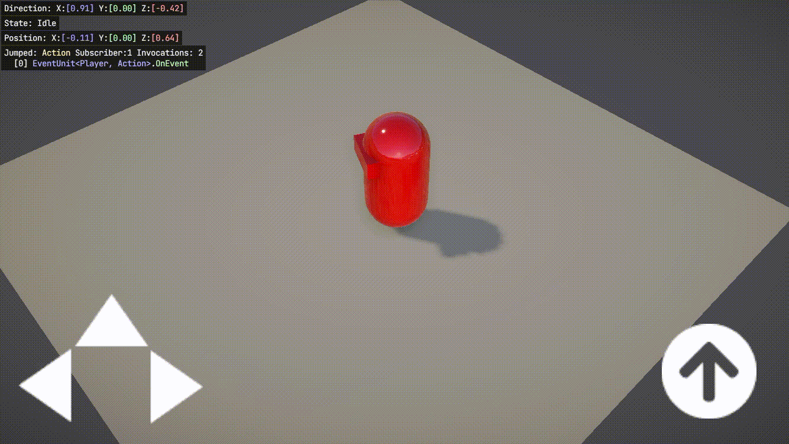

# Runtime Monitoring Device Test
Project to test that [Runtime Monitoring](https://github.com/JohnBaracuda/Runtime-Monitoring) works on actual smartphone devices.

   

Because README of Runtime Monitoring says as following, I created an environment where I can test it.

> I can't test all of these platforms for compatibility. Let me know if you have tested any platform that is NA or not listed here.

It worked well on both iOS/Android in the environment at hand.
